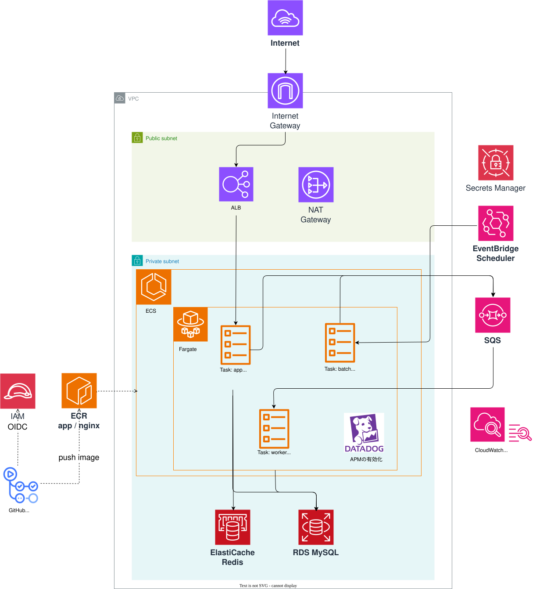

## システム概要

RSS フィードから記事を自動収集する **フィードアグリゲーター**。  
Laravel + ECS Fargate で構成され、SQS を介した非同期ジョブ処理と EventBridge による定期バッチ実行を組み合わせたサーバーレス志向のアーキテクチャ。

```
ユーザー → ALB → ECS app → SQS → ECS worker → RDS (記事保存)
                               ↑
               EventBridge → ECS batch（定期実行）
```

> 構成図は `terraform/infra.drawio` に管理。`.mcp.json` で draw.io MCP サーバーが設定されており、Claude Code から図の作成・編集が可能。

---

## アーキテクチャのポイント

### 1. 非同期ジョブ処理（SQS + Worker）
`POST /api/feeds` はフィードを DB に登録した直後に SQS へジョブを投げてレスポンスを返す。  
実際の RSS 取得・記事保存は worker が非同期で行う。

### 2. SQS へのジョブ投入は2つのルート
| トリガー | 処理 | 用途 |
|---|---|---|
| `POST /api/feeds` | app が即時 dispatch | 新規フィード登録時の初回取得 |
| EventBridge（定期） | batch が全フィード分 dispatch | 既存フィードの定期更新 |

どちらも同じ `FetchFeedJob` を使い、worker が処理する。

### 3. ECS Fargate による役割分離
| タスク | 常駐/単発 | 役割 |
|---|---|---|
| app | 常駐（ECS Service） | nginx + PHP-FPM。API リクエストを処理 |
| worker | 常駐（ECS Service） | SQS をポーリングしてジョブを処理 |
| batch | 単発（ECS Task） | EventBridge からトリガーされる feeds:fetch |

### 4. Datadog APM によるオブザーバビリティ
各 ECS タスクに **Datadog Agent サイドカー**を配置し、APM トレースとコンテナメトリクスを収集。

### 5. Infrastructure as Code（Terraform）
全 AWS リソースを Terraform で管理。モジュール構成：

```
modules/
├── network      # VPC・サブネット・NAT Gateway
├── sg           # セキュリティグループ
├── alb          # ALB・ターゲットグループ
├── ecs          # ECS クラスター・タスク定義・サービス
├── rds          # RDS MySQL
├── redis        # ElastiCache Redis
├── sqs          # SQS キュー
├── ecr          # コンテナイメージレジストリ
├── eventbridge  # スケジューラー
└── iam-github-actions  # GitHub Actions 用 OIDC 認証
```

### 6. GitHub Actions による CI/CD（OIDC 認証）
長期クレデンシャル不要。GitHub Actions から AWS へは **OIDC** で一時認証し、ECR へのイメージ push と ECS サービス更新を自動化。

### 7. セキュリティ設計
- ECS タスクはすべて**プライベートサブネット**に配置
- アウトバウンド通信は NAT Gateway 経由
- DB パスワード・Datadog API Key は **Secrets Manager** で管理し、タスク起動時に注入

---

## AWS インフラ構成

```
Internet
   │
   ▼
[ALB]
   │
   ▼
[ECS Fargate - app]
  ├─ nginx コンテナ（リバースプロキシ）
  └─ app コンテナ（PHP-FPM）
       ├─ [RDS MySQL]
       ├─ [ElastiCache Redis]
       └─ [SQS] ─── [ECS Fargate - worker]
                          └─ php artisan queue:work sqs

[EventBridge Scheduler] ─── 12時間ごと ───▶ [ECS Fargate - batch]
                                                  └─ php artisan feeds:fetch
```
---

## API エンドポイント

### フィード

| メソッド | パス | 説明 |
|---|---|---|
| GET | `/api/feeds` | フィード一覧取得 |
| POST | `/api/feeds` | フィード登録 & 記事取得ジョブ発行 |

**POST /api/feeds リクエスト例**
```bash
# ローカル
curl -X POST http://localhost:8080/api/feeds \
  -H "Content-Type: application/json" \
  -H "Accept: application/json" \
  -d '{"name": "Qiita", "url": "https://qiita.com/popular-items/feed"}'

# 本番（ALB経由）
curl -X POST http://<alb-dns-name>/api/feeds \
  -H "Content-Type: application/json" \
  -H "Accept: application/json" \
  -d '{"name": "Qiita", "url": "https://qiita.com/popular-items/feed"}'
```

**レスポンス例 (201)**
```json
{
  "id": 1,
  "name": "Qiita",
  "url": "https://qiita.com/popular-items/feed",
  "last_fetched_at": null,
  "created_at": "2026-03-20T06:00:00.000000Z",
  "updated_at": "2026-03-20T06:00:00.000000Z"
}
```

### 記事

| メソッド | パス | 説明 |
|---|---|---|
| GET | `/api/articles` | 記事一覧取得 (20件ページネーション) |
| GET | `/api/articles/{id}` | 記事詳細取得 |

---

## データの流れ

```
1. POST /api/feeds
   └─ FeedController::store()
        ├─ feeds テーブルに登録
        └─ FetchFeedJob を SQS に送信

2. worker（常駐 ECS Service）
   └─ php artisan queue:work sqs
        └─ SQS をポーリング（3秒おき）
             └─ FetchFeedJob::handle()
                  ├─ フィード URL に HTTP GET（NAT Gateway 経由）
                  ├─ RSS/Atom XML をパース
                  ├─ 記事を articles テーブルに保存 (firstOrCreate)
                  └─ feeds.last_fetched_at を更新

3. EventBridge Scheduler（12時間ごと）
   └─ ECS batch タスクを単発起動
        └─ php artisan feeds:fetch
             └─ 全フィードをループして FetchFeedJob を SQS に送信
                  └─ 以降は 2. と同じ流れ
```

---

## DB スキーマ

### feeds

| カラム | 型 | 説明 |
|---|---|---|
| id | bigint | PK |
| name | string | フィード名 |
| url | string (unique) | フィードURL |
| last_fetched_at | timestamp nullable | 最終取得日時 |

### articles

| カラム | 型 | 説明 |
|---|---|---|
| id | bigint | PK |
| feed_id | bigint (FK) | feeds.id |
| url | string (unique) | 記事URL |
| title | string nullable | 記事タイトル |
| body | longtext nullable | 記事本文（未実装） |
| status | enum | pending / scraped / failed |
| published_at | timestamp nullable | 記事公開日時 |

---

## ローカル開発環境

ローカルでは Docker Compose を使い、AWS サービスを以下のように差し替える。

| 本番 (AWS) | ローカル (Docker) |
|---|---|
| RDS MySQL | mysql コンテナ |
| ElastiCache Redis | redis コンテナ |
| SQS | localstack コンテナ |
| ALB | nginx コンテナ |

### ローカルアーキテクチャ

```
                        Docker Network
  ┌─────────────────────────────────────────────────────────┐
  │                                                         │
  │  [Client]                                               │
  │     │                                                   │
  │     ▼                                                   │
  │  ┌─────────────────┐                                    │
  │  │  nginx          │（リバースプロキシ）                 │
  │  └─────────────────┘──────────────────┐                 │
  │                                       ▼                 │
  │  ┌─────────────────┐  MySQL    ┌─────────────────┐      │
  │  │  mysql          │◀──────────│  app            │      │
  │  └─────────────────┘  ┌────────│                 │      │
  │                        │        └────────┬────────┘      │
  │  ┌─────────────────┐  │                │ SQS送信        │
  │  │  redis          │◀─┘        ┌────────▼────────┐      │
  │  └─────────────────┘           │  localstack     │      │
  │                                └────────┬────────┘      │
  │                                         │ SQSポーリング  │
  │  ┌─────────────────┐           ┌────────▼────────┐      │
  │  │  mysql          │◀──────────│  worker         │      │
  │  │  (articlesへ保存)│  MySQL    │  queue:work sqs │      │
  │  └─────────────────┘           └─────────────────┘      │
  └─────────────────────────────────────────────────────────┘
```

### コンテナの依存関係

```
nginx ──depends_on──▶ app
app   ──depends_on──▶ mysql (healthy)
                   ──▶ redis
                   ──▶ localstack
worker──depends_on──▶ app
```

### 起動手順

```bash
# .env を用意
cp src/.env.example src/.env

# コンテナ起動
docker-compose up -d

# マイグレーション実行
docker-compose exec app php artisan migrate
```

### キューの確認（localstack）

- **キュー名**: `articles`
- **DLQ**: `articles-dlq`（3回失敗でデッドレターキューへ）
- **リトライ**: 最大3回 (`FetchFeedJob::$tries = 3`)

```bash
# キュー一覧
docker-compose exec localstack awslocal sqs list-queues

# メッセージ数の確認
docker-compose exec localstack awslocal sqs get-queue-attributes \
  --queue-url http://sqs.us-east-1.localhost.localstack.cloud:4566/000000000000/articles \
  --attribute-names ApproximateNumberOfMessages ApproximateNumberOfMessagesNotVisible

# DLQ のメッセージ数
docker-compose exec localstack awslocal sqs get-queue-attributes \
  --queue-url http://sqs.us-east-1.localhost.localstack.cloud:4566/000000000000/articles-dlq \
  --attribute-names ApproximateNumberOfMessages
```

| 属性 | 説明 |
|---|---|
| `ApproximateNumberOfMessages` | 未処理のメッセージ数 |
| `ApproximateNumberOfMessagesNotVisible` | Worker が処理中のメッセージ数 |

---

## ECRへのイメージ push 手順

```bash
# ECRにログイン
aws ecr get-login-password --region ap-northeast-1 | \
  docker login --username AWS --password-stdin <account_id>.dkr.ecr.ap-northeast-1.amazonaws.com

# appイメージをビルド（Apple SiliconはAMD64を指定）
docker build --platform linux/amd64 -f Dockerfile \
  -t <ecr_app_repository_url>:latest .

# nginxイメージをビルド
docker build --platform linux/amd64 -f docker/nginx/Dockerfile \
  -t <ecr_nginx_repository_url>:latest .

# push
docker push <ecr_app_repository_url>:latest
docker push <ecr_nginx_repository_url>:latest

# ECSサービスを更新
aws ecs update-service \
  --cluster sre-playground-prod \
  --service sre-playground-prod-app \
  --force-new-deployment \
  --region ap-northeast-1
```

`terraform output` でECRのURLを確認できる。

---

## ECS でマイグレーションを実行

```bash
aws ecs run-task \
  --cluster sre-playground-prod \
  --task-definition sre-playground-prod-app \
  --launch-type FARGATE \
  --network-configuration "awsvpcConfiguration={subnets=[<private_subnet_id>],securityGroups=[<app_sg_id>],assignPublicIp=DISABLED}" \
  --overrides '{"containerOverrides":[{"name":"app","command":["php","artisan","migrate","--force"]}]}' \
  --region ap-northeast-1
```
